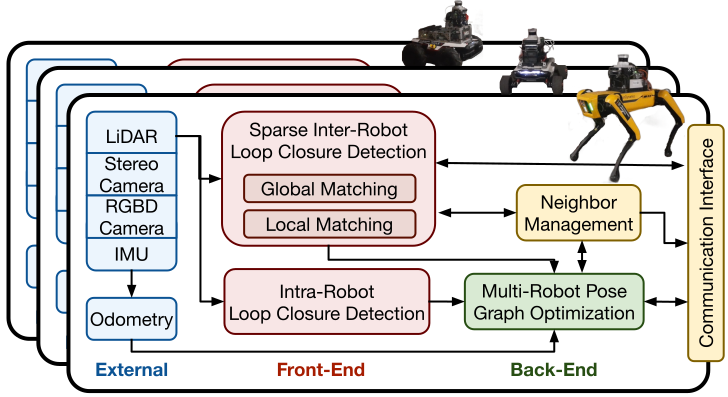
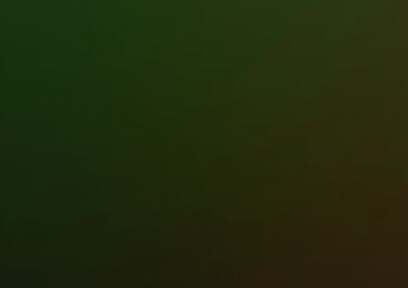
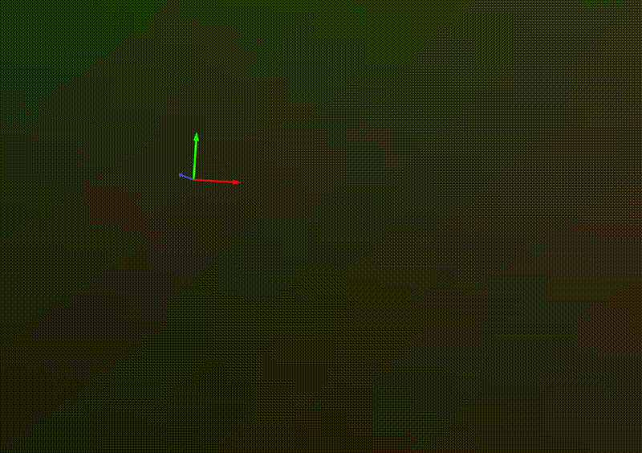

# Localization-and-Mapping-using-Drones-and-Robotics

  
  

SLAM is an open-source C-SLAM system designed to be scalable, flexible, decentralized, and sparse, which are all key properties in swarm robotics. Our system supports lidar, stereo, and RGB-D sensing, and it includes a novel inter-robot loop closure prioritization technique that reduces inter-robot communication and accelerates the convergence.

Packages summary:
- [cslam](https://github.com/lajoiepy/cslam): contains the Swarm-SLAM nodes;
- [cslam_interfaces](https://github.com/lajoiepy/cslam_interfaces): contains the custom ROS 2 messages;
- [cslam_experiments](https://github.com/lajoiepy/cslam_experiments): contains examples of launch files and configurations for different setups;
- [cslam_visualization](https://github.com/lajoiepy/cslam_visualization): contains an online (optional) visualization tool to run on your base station to monitor the mapping progress.

Follow the [start-up instructions](https://lajoiepy.github.io/cslam_documentation/html/md_startup-instructions.html) to install, build and run Swarm-SLAM.

